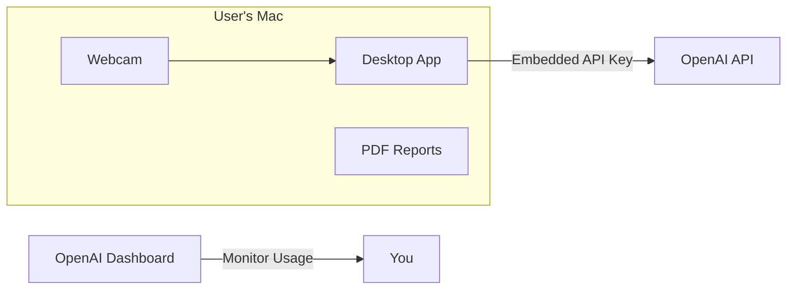

# Gavin AI - Simplified MVP Plan

## What Changed (Simplifications)

| Original Plan | Simplified Plan |

|--------------|-----------------|

| Backend with auth + usage tracking | No backend - embed API key, monitor via OpenAI dashboard |

| Build for macOS + Windows | macOS first, Windows later (remote testing with dad) |

| Invite code system | No codes needed - just share download link |

| Per-user usage limits | Global limit - monitor manually, revoke key if needed |

---

## Architecture (Much Simpler)



No backend server. Direct API calls. Manual monitoring.

---

## Phase 1: Simple Desktop GUI

Build a minimal tkinter GUI around existing code.

**Features:**

- Start/Stop session button
- Status indicator (Focused / Away / Phone Detected)  
- Session timer
- "Generate Report" button
- Privacy notice (one-time popup explaining OpenAI data usage)

**Files to create:**

- `gui/app.py` - Main GUI application
- `gui/assets/icon.png` - App icon

**Reuse existing:**

- [`camera/capture.py`](camera/capture.py) - Webcam handling
- [`camera/vision_detector.py`](camera/vision_detector.py) - AI detection
- [`tracking/session.py`](tracking/session.py) - Session management
- [`reporting/pdf_report.py`](reporting/pdf_report.py) - PDF generation

**Estimated time:** 2-3 days

---

## Phase 2: macOS Packaging

Package as a standalone `.app` that anyone can run.

**Tools:** PyInstaller

**Steps:**

1. Create `build/build_macos.sh` script
2. Bundle all dependencies into single `.app`
3. Create `.dmg` installer (optional, makes distribution cleaner)
4. Test on your Mac with a fresh user account (to catch missing dependencies)

**Code signing:** Skip for MVP. Users will see "unidentified developer" warning - they right-click → Open to bypass. This is fine for 20-50 trusted testers.

**Estimated time:** 1-2 days

---

## Phase 3: Landing Page + Distribution

Create a simple public page for downloads.

**Option A: GitHub Pages (Recommended)**

- Free hosting
- Lives at `yourusername.github.io/gavin-ai`
- Simple HTML page with download button
- Can update by pushing to repo

**Option B: Notion Page**

- Even simpler - just create a Notion page
- Add download link (host file on GitHub Releases)
- Share Notion link with testers

**Landing page content:**

1. What Gavin AI does (1-2 sentences)
2. Download button (macOS)
3. Quick start instructions (3-4 steps)
4. Privacy note
5. Your contact for feedback

**Estimated time:** Half day

---

## Phase 4: Windows Support (Deferred)

Handle this after macOS version is working and tested.

**Options for building Windows version:**

1. **GitHub Actions** - Set up CI to build Windows `.exe` automatically (no Windows PC needed)
2. **Remote testing with dad** - Send him the build, video call for testing
3. **Windows VM on Mac** - Use Parallels/VMware to test locally

**Recommendation:** Use GitHub Actions to build, have your dad test remotely. This way you don't need Windows hardware.

**Estimated time:** 1-2 days (after macOS is stable)

---

## API Key Management (Simple Approach)

**How it works:**

1. Embed your OpenAI API key in the app (in [`config.py`](config.py) or environment)
2. Set a spending limit on OpenAI dashboard ($20-50 for testing phase)
3. Monitor usage daily via OpenAI dashboard
4. If someone abuses it, rotate the key and push an update

**Security consideration:** Yes, technically someone could extract the key from the binary. But:

- These are trusted testers (friends/family)
- You have spending limits set
- You can rotate the key anytime
- For 20-50 people, this risk is acceptable

---

## Timeline

| Phase | Duration | Notes |

|-------|----------|-------|

| Phase 1: GUI | 2-3 days | Core development |

| Phase 2: macOS Packaging | 1-2 days | Test thoroughly |

| Phase 3: Landing Page | 0.5 days | Simple HTML |

| Phase 4: Windows (deferred) | 1-2 days | After macOS stable |

**Total for macOS MVP:** ~4-6 days

---

## Checklist Before Distribution

- [ ] App launches without errors
- [ ] Webcam permission request works
- [ ] Detection runs (shows status changes)
- [ ] Session can be stopped
- [ ] PDF report generates and opens
- [ ] App works after quitting and reopening
- [ ] Tested on a different Mac user account
- [ ] Landing page has correct download link
- [ ] OpenAI spending limit is set
- [ ] Privacy notice displays on first launch

---

## Feedback Collection (Simple)

Since you don't want automatic analytics:

- Add your email/phone to the landing page
- Ask testers to message you with feedback
- Keep a simple notes doc of what people report
- After 1-2 weeks, review feedback and decide on v1.1 features

---

## File Structure After Changes

```
gavin_ai/
├── gui/
│   ├── __init__.py
│   └── app.py              # Main GUI (NEW)
├── build/
│   └── build_macos.sh      # Build script (NEW)
├── docs/
│   └── landing/
│       └── index.html      # Landing page (NEW)
├── (existing files unchanged)
└── dist/                   # PyInstaller output (gitignored)
```

---

## Ready to Start?

When you're ready to begin, we'll start with Phase 1 (GUI development). I'll help you create the tkinter interface that wraps your existing detection code.